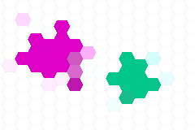

# Java-web-jhlabs

REST API for jhlabs filters generation.

Supported filters by [jhlabs](http://www.jhlabs.com/ip/filters/):
* POINTILLIZE
* BLUR
* WATER
* RIPPLE
* SHADOW

# How to 

[Play](https://docker-image-api.herokuapp.com/)

# Build

```
make run
```

# Browser

http://localhost:8080


Input


Output - Filter pointillize



# Using terminal

```
curl "http://localhost:8080/filter" \
-F file=@doc/input.png \
-F name=pointillize \
-F output=png > output.png
```

or with Docker

```
make docker-build
make docker-run
```
